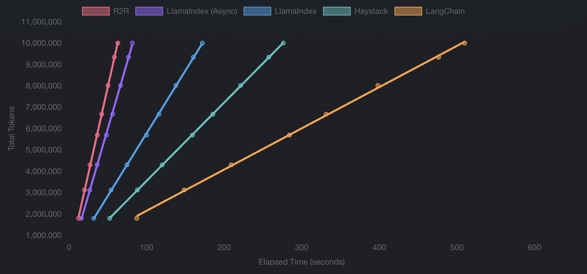

# Reliable, reproducable RAG solution benchmarks

An open-source benchmarking suite for benchmarking Retrieval-Augmented Generation (RAG) solutions.

## About
In the rapidly evolving space of RAG, developers face a critical decision: which tool will best serve their project's needs? We've designed this benchmarking suite to provide a comparative analysis of popular RAG solutions.

## Scalable Ingestion (Updated 7/15/2024)
Our scalable ingestion test aimed to simulate a high-volume data environment, pushing each solution to its limits. This test provides
crucial insights into how these tools might perform in data-intensive, real-world scenarios.

We leveraged the [HuggingFace Legacy Datasets' Wikipedia corpus](https://huggingface.co/datasets/legacy-datasets/wikipedia) for this
benchmark. This dataset offers a diverse range of articles, making it an ideal candidate for testing RAG systems. Each framework was tasked
with ingesting articles as per their recommended practices, allowing us to measure their performance under optimal conditions.

### Table 1: Ingestion Time over 10008026 Tokens
| Solution | Time Elapsed (s) |
|-----------|--------------|
| [R2R](https://github.com/SciPhi-AI/R2R) | 62.97 |
| LlamaIndex (Async) | 81.54 |
| [LlamaIndex](https://github.com/run-llama/llama_index) | 171.93 |
| [Haystack](https://github.com/deepset-ai/haystack) | 276.27 |
| [LangChain](https://github.com/langchain-ai/langchain) | 510.04 |

### Figure 1: Tokens Ingested vs. Time

The steeper the better, as the rate indicates faster ingestion

## Individual File Ingestion (Updated 7/15/2024)
To complement our bulk ingestion test, we also examined how each solution handles individual file processing. This test simulates typical user interactions, such as uploading single documents or small batches of files.

Our test suite included two text files of similar size but different content, and two PDF files of identical size but varying complexity.
We measured three key metrics for each file:
- Ingestion Time
- Tokens processed per second (for text files)
- Megabytes processed per second

Additionally, we tested combined ingestion of identical file types to assess each solution's performance with multi-file uploads.

### Table 2: Time taken to Ingest Files
| Metric | Shakespeare | Churchill | Combined txt | University Physics | Introductory Statistics | Combined PDF |
|---|---|---|---|---|---|---|
| [**R2R**](https://github.com/SciPhi-AI/R2R) | 7.04 | 9.07 | 9.58 | 8.57 | 14.6 | 20.7 |
| [**LlamaIndex**](https://github.com/run-llama/llama_index) | 67.0 | 57.7 | 189 | 7.92 | 18.0 | 25.3 |
| [**Haystack**](https://github.com/deepset-ai/haystack) | 18.8 | 16.8 | 37.8 | 8.17 | 17.0 | 24.9 |
| [**LangChain**](https://github.com/langchain-ai/langchain) | 65.2 | 64.7 | 134 | 9.31 | 24.7 | 35.2 |
| [**RagFlow**](https://github.com/infiniflow/ragflow) | 1630 | 3800 | | | | |

### Table 3: Megabytes per Second Throughput
| Metric | Shakespeare | Churchill | Combined txt | University Physics | Introductory Statistics | Combined PDF |
|---|---|---|---|---|---|---|
| [**R2R**](https://github.com/SciPhi-AI/R2R) | 0.767 | 0.628 | 1.159 | 3.127 | 1.833 | 2.593 |
| [**LlamaIndex**](https://github.com/run-llama/llama_index) | 0.081 | 0.099 | 0.056 | 3.384 | 1.490 | 2.121 |
| [**Haystack**](https://github.com/deepset-ai/haystack) | 0.288 | 0.338 | 1.416 | 3.280 | 1.573 | 2.156 |
| [**LangChain**](https://github.com/langchain-ai/langchain) | 0.083 | 0.088 | 0.082 | 2.879 | 1.086 | 1.523 |
| [**RagFlow**](https://github.com/infiniflow/ragflow) | 0.003 | 0.001 | | | | |

## Reproducing
We encourage you to reproduce the benchmarks that we report. Instructions to run benchmarking scripts are located in the source code for each benchmark.

## Contributing
We welcome contributions of all sizes! Here's how you can help:
- New benchmarks: Is there a benchmark that you think would be helpful? Feel free to add it in!
- New Solutions: Add additional providers.
